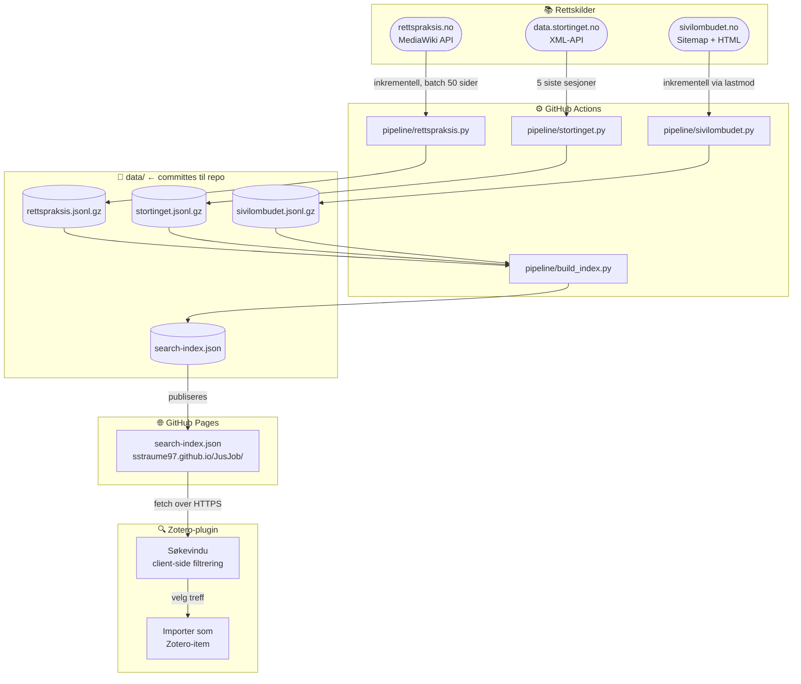

# JusJob

Et verktøy for juridisk research som henter og indekserer norske rettskilder automatisk, og gjør dem søkbare direkte inni Zotero.

Prosjektet består av to deler:

- **Datapipeline** (`pipeline/`) — Python-skript som henter data fra ulike rettskilder, kjøres automatisk via GitHub Actions og publiserer resultatet til GitHub Pages
- **Zotero-plugin** (`plugin/`) — en utvidelse for Zotero 7 som søker i den publiserte indeksen og lar deg importere treff som Zotero-items

---

## Arkitektur



Alle data-filer committes til repoet og publiseres som statiske filer via GitHub Pages. Zotero-pluginen henter `search-index.json` over HTTPS og søker client-side — ingen server å drifte.

---

## Kilder

### Lovverk og forarbeider

| Kilde | Type rettskilder | Status | Metode |
|---|---|---|---|
| [Lovdata (gratis)](https://lovdata.no) | Lover, forskrifter | ⏳ Ikke startet | NLOD 2.0 åpne data (XML-eksport) |
| [Stortinget](https://data.stortinget.no) | Saker, Prop., Innst., Dok. 8, vedtak, møtereferater | ✅ Implementert | Offisielt XML-API |
| [Regjeringen.no](https://www.regjeringen.no) | NOU-er, høringer, proposisjoner, rundskriv | ⏳ Ikke startet | HTML-skraping |
| [EUR-Lex / EØS-notater](https://eur-lex.europa.eu) | EU-forordninger, direktiver, EØS-notater | ⏳ Ikke startet | EUR-Lex REST API + regjeringen.no/eos |

### Rettsavgjørelser

| Kilde | Type rettskilder | Status | Metode |
|---|---|---|---|
| [rettspraksis.no](https://www.rettspraksis.no) | Høyesterett, lagmannsretter, tingretter (CC-lisens) | ✅ Implementert | MediaWiki API (`/w/api.php`) |
| [Lovdata (gratis)](https://lovdata.no) | Et utvalg Høyesteretts-avgjørelser (gratisdelen) | ⏳ Ikke startet | NLOD 2.0 åpne data |
| [Domstol.no](https://www.domstol.no) | Avgjørelser fra tingrett/lagmannsrett (fritt tilgjengelige) | ⏳ Ikke startet | HTML-skraping |
| [EFTA-domstolen / EU-domstolen](https://www.eftacourt.int) | EØS-relevante avgjørelser | ⏳ Ikke startet | EFTA Court API / curia.europa.eu |
| [EMD / HUDOC](https://hudoc.echr.coe.int) | Den europeiske menneskerettsdomstolen | ⏳ Ikke startet | HUDOC JSON API |

### Tilsyn, ombud og kontrollorganer

| Kilde | Type rettskilder | Status | Metode |
|---|---|---|---|
| [Sivilombudet](https://www.sivilombudet.no) | Uttalelser | ✅ Implementert | HTML-skraping via sitemap.xml |
| [Helsetilsynet](https://www.helsetilsynet.no) | Tilsynsrapporter, vedtak | ⏳ Ikke startet | HTML-skraping |
| [Riksrevisjonen](https://www.riksrevisjonen.no) | Revisjonsrapporter, undersøkelser | ⏳ Ikke startet | HTML-skraping |
| [Datatilsynet](https://www.datatilsynet.no) | Vedtak, veiledninger | ⏳ Ikke startet | HTML-skraping |
| [Forbrukertilsynet](https://www.forbrukertilsynet.no) | Vedtak, retningslinjer | ⏳ Ikke startet | HTML-skraping |
| [LDO / Diskrimineringsnemnda](https://www.diskrimineringsnemnda.no) | Vedtak, uttalelser | ⏳ Ikke startet | HTML-skraping |

### Klage- og nemndsorganer

| Kilde | Type rettskilder | Status | Metode |
|---|---|---|---|
| [Trygderetten](https://www.trygderetten.no) | Kjennelser | ⏳ Ikke startet | HTML-skraping |
| [Pasientskadenemnda (NPE)](https://www.npe.no) | Vedtak | ⏳ Ikke startet | HTML-skraping |
| [Husleietvistutvalget](https://www.htu.no) | Avgjørelser | ⏳ Ikke startet | HTML-skraping |

### Andre forvaltningskilder

| Kilde | Type rettskilder | Status | Metode |
|---|---|---|---|
| [KUDOS (DFØ)](https://kudos.dfo.no) | Styringsdokumenter, evalueringer | ⏳ Ikke startet | HTML-skraping |
| [Departementenes rundskriv](https://www.regjeringen.no/rundskriv) | Rundskriv per departement | ⏳ Ikke startet | HTML-skraping (underside av regjeringen.no) |

---

## Datapipeline i detalj

### Inkrementell henting

Ingen scraper henter alt fra bunnen av ved hver kjøring. I stedet lagres tilstandsinformasjon i data-filene mellom kjøringer:

- **rettspraksis.no**: MediaWiki-APIet brukes til å hente revisjons-ID (`lastrevid`) for alle sider i batch (50 sider per API-kall). Sideinnhold hentes kun for sider der revisjons-ID har endret seg siden forrige kjøring.
- **Sivilombudet**: Sitemap-filene (`uttalelser-sitemap.xml`, `uttalelser-sitemap2.xml`) inneholder `<lastmod>`-tidspunkt for hver uttalelse. HTML hentes kun for sider med nyere `lastmod` enn det som er lagret.
- **Stortinget**: Henter alle saker per sesjon fra det offisielle XML-APIet. Kjøres for de fem siste sesjonene.

Den daglige cron-jobben er begrenset til `MAX_NEW_PAGES=2000` nye sider fra rettspraksis.no per kjøring, slik at den holder seg godt under en time. Bootstrapping (første gangs full henting) gjøres via en separat manuell workflow.

### Søkeindeksen

`pipeline/build_index.py` slår sammen alle kilde-filer til én `search-index.json`. Hvert element har disse feltene:

```json
{
  "id":           "rettspraksis-192647",
  "source":       "rettspraksis.no",
  "type":         "rettsavgjørelse",
  "title":        "HR-1815-1",
  "court_or_body": "Høyesterett",
  "url":          "https://www.rettspraksis.no/wiki/HR-1815-1",
  "snippet":      "Første 300 tegn av sideteksten …"
}
```

Alle kildetyper konverteres til dette felles formatet, slik at Zotero-pluginen kan søke og vise treff uavhengig av hvilken kilde de kommer fra.

### Filstørrelser

Rådata lagres som komprimerte JSONL-filer (`.jsonl.gz`). Kun metadata og et kort tekstutdrag (snippet) lagres — ikke fulltekst — for å holde filene under GitHubs 100 MB-grense:

| Fil | Innhold |
|---|---|
| `data/rettspraksis.jsonl.gz` | ~60 000 rettsavgjørelser med tittel, domstol, revisjons-ID, snippet og URL |
| `data/stortinget.jsonl.gz` | ~3 000–4 000 saker per sesjon × 5 sesjoner |
| `data/sivilombudet.jsonl.gz` | ~1 950 uttalelser med saksnummer, dato, sammendrag og URL |
| `data/search-index.json` | Alle kilder slått sammen til ett søkbart JSON-array |

---

## GitHub Actions-workflows

| Workflow | Trigger | Hva den gjør |
|---|---|---|
| `update.yml` | Daglig kl. 03:00 UTC + manuelt | Kjører alle skraperne (maks 2 000 nye rettspraksis-sider), bygger indeks, committer data og publiserer til Pages |
| `bootstrap-rettspraksis.yml` | Manuelt | Henter alle sider fra rettspraksis.no uten begrensning — kjøres én gang for å etablere den første fullstendige databasen |

---

## Zotero-plugin

Pluginen er et skjelett og er **ikke ferdig testet**. Se [`plugin/README.md`](plugin/README.md) for status og instruksjoner for å teste i Zotero.

### Implementert (skjelett, utestet)

- Legger til "Søk i rettskilder (JusJob)…" under Verktøy-menyen i Zotero
- Søkevindu som henter `search-index.json` fra GitHub Pages og søker client-side
- Importerer valgte treff som Zotero-items (bruker Zoteros innebygde `Case`-type for rettsavgjørelser, `Document` for øvrig)

### Gjenstår — plugin-funksjoner

| Funksjon | Beskrivelse | Status |
|---|---|---|
| **Søkepanel i Zotero** | Ferdigstille og teste søkevinduet; filtrering per kilde og kildetyp | 🚧 Skjelett |
| **Norsk juridisk sitatstil (CSL)** | Ny CSL-stil som siterer lover, dommer og forarbeider korrekt etter norsk juridisk tradisjon (f.eks. `Rt. 2013 s. 1`, `NOU 2020: 4`, `Lov 1902-05-22 nr 10`) | ⏳ Ikke startet |
| **Zotero Connector-translator** | `Save to Zotero`-knapp i nettleseren som gjenkjenner kildetypen (lov, dom, forarbeid) på støttede sider og henter riktige metadata automatisk | ⏳ Ikke startet |
| **Sitatsjekk** | Lim inn en henvisning (f.eks. `Rt. 2013 s. 1170`) og få den automatisk slått opp og lagt i Zotero med riktige felt | ⏳ Ikke startet |
| **Forarbeidskjede-bygger** | Gitt en lovbestemmelse, foreslå komplett kjede: NOU → Prop. → Innst. → lovvedtak, basert på Stortinget-API | ⏳ Ikke startet |
| **Endringshistorikk-varsling** | Følg en lov/bestemmelse og få varsel i Zotero når Lovdata viser at den er endret | ⏳ Ikke startet |
| **Eksport til juridisk notat** | Generer ferdig fotnoteliste i Word/PDF fra valgte Zotero-items i riktig norsk juridisk sitering | ⏳ Ikke startet |
| **Automatisk kobling mellom kilder** | En lov i Zotero-biblioteket lenkes automatisk til relevante forarbeider og rettsavgjørelser som allerede er lagret | ⏳ Ikke startet |

### Planlagt plugin-struktur (fullversjon)

```
plugin/
  manifest.json
  bootstrap.js
  chrome.manifest
  chrome/content/jusjob/
    search.xhtml          – søkepanel (under utvikling)
    search.js
  resource/translators/   – Zotero Connector-translators per kilde
    lovdata.js
    stortinget.js
    rettspraksis.js
    sivilombudet.js
  csl/
    jusjob-juridisk.csl   – norsk juridisk sitatstil
```

---

## Kjøre lokalt

```bash
pip install -r requirements.txt

python pipeline/stortinget.py     # skriver data/stortinget.jsonl.gz
python pipeline/sivilombudet.py   # skriver data/sivilombudet.jsonl.gz
python pipeline/rettspraksis.py   # skriver data/rettspraksis.jsonl.gz  (tar ~15 min første gang)
python pipeline/build_index.py    # skriver data/search-index.json
```

Miljøvariabelen `MAX_NEW_PAGES` begrenser antall nye sider rettspraksis-scraperen henter. Sett den til f.eks. `500` for en rask test:

```bash
MAX_NEW_PAGES=500 python pipeline/rettspraksis.py
```

---

## Sette opp GitHub Pages (én gang)

1. Gå til **Settings → Pages** i dette repoet
2. Under "Build and deployment" → Source: velg **GitHub Actions**
3. Kjør `bootstrap-rettspraksis.yml` manuelt én gang via Actions-fanen
4. Deretter kjører `update.yml` daglig automatisk
