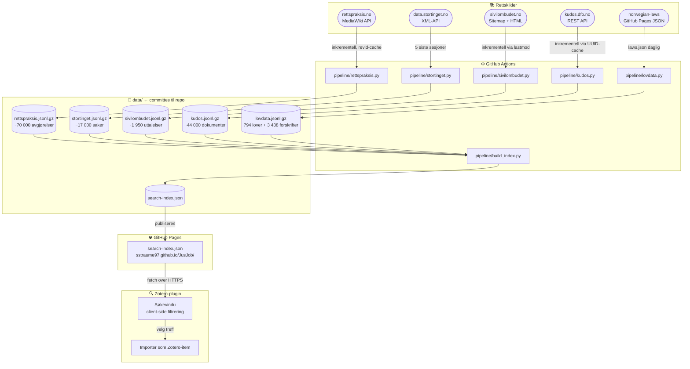

# JusJob

Et verktøy for juridisk research som henter og indekserer norske rettskilder automatisk, og gjør dem søkbare direkte i Zotero.

**[→ Åpne datasiden](https://sstraume97.github.io/JusJob/)** · **[→ Indeks-skjema](docs/indeks-skjema.md)** · **[→ Relaterte ressurser](docs/relaterte-ressurser.md)**

---

## Arkitektur



Alle datafiler committes til repoet og publiseres via GitHub Pages. Zotero-pluginen søker client-side — ingen server å drifte.

---

## Kilder

| Kilde | Type | Status | Kategori |
|---|---|---|---|
| [rettspraksis.no](https://www.rettspraksis.no) | Høyesterett, lagmannsretter, tingretter | ✅ | Rettsavgjørelser |
| [Stortinget](https://data.stortinget.no) | Saker, Prop., Innst., vedtak | ✅ | Lovverk og forarbeider |
| [Sivilombudet](https://www.sivilombudet.no) | Uttalelser | ✅ | Tilsyn og ombud |
| [KUDOS (DFØ)](https://kudos.dfo.no) | NOU-er, studier, rapporter | ✅ | Forvaltning |
| [norwegian-laws](https://github.com/sondreskarsten/norwegian-laws) | 794 lover + 3 438 forskrifter | ⏳ | Lovverk |
| [Regjeringen.no](https://www.regjeringen.no) | NOU-er, høringer, rundskriv | ⏳ | Lovverk og forarbeider |
| [Domstol.no](https://www.domstol.no) | Fritt tilgjengelige dommer | ⏳ | Rettsavgjørelser |
| [Datatilsynet](https://www.datatilsynet.no) | Vedtak, veiledninger | ⏳ | Tilsyn |
| [Helsetilsynet](https://www.helsetilsynet.no) | Tilsynsrapporter, vedtak | ⏳ | Tilsyn |
| [Riksrevisjonen](https://www.riksrevisjonen.no) | Revisjonsrapporter | ⏳ | Tilsyn |
| [Forbrukertilsynet](https://www.forbrukertilsynet.no) | Vedtak | ⏳ | Tilsyn |
| [LDO / Diskrimineringsnemnda](https://www.diskrimineringsnemnda.no) | Vedtak, uttalelser | ⏳ | Tilsyn |
| [Klagenemdsekretariatet](https://www.klagenemndssekretariatet.no/) | KOFA, Konkurranseklagenemnda m.fl. | ⏳ | Klage og nemnd |
| [Trygderetten](https://www.trygderetten.no) | Kjennelser | ⏳ | Klage og nemnd |
| [Pasientskadenemnda (NPE)](https://www.npe.no) | Vedtak | ⏳ | Klage og nemnd |
| [Husleietvistutvalget](https://www.htu.no) | Avgjørelser | ⏳ | Klage og nemnd |
| [EMD / HUDOC](https://hudoc.echr.coe.int) | Menneskerettsdomstolen | ⏳ | Internasjonal |
| [EFTA/EU-domstolen](https://www.eftacourt.int) | EØS-avgjørelser | ⏳ | Internasjonal |
| [EUR-Lex](https://eur-lex.europa.eu) | EU-forordninger, direktiver | ⏳ | Internasjonal |

Se [docs/indeks-skjema.md](docs/indeks-skjema.md) for detaljert feltdefinisjon og lenkestrategi mellom kilder.

---

## Zotero-plugin

Plugin-en er et skjelett under utvikling. Planlagte funksjoner:

- Søkepanel med filtrering per kilde og kildetyp
- Norsk juridisk sitatstil (CSL): `Rt. 2013 s. 1`, `NOU 2020: 4`, `Lov 1902-05-22 nr 10`
- Zotero Connector-translators per kilde
- Sitatsjekk, forarbeidskjede-bygger, endringshistorikk-varsling
- Eksport til juridisk notat (Word/PDF)
- Automatisk kobling mellom lover, forarbeider og dommer

---

## Kom i gang

```bash
pip install -r requirements.txt
python pipeline/stortinget.py
python pipeline/sivilombudet.py
python pipeline/kudos.py
python pipeline/rettspraksis.py   # tar ~30 min første gang
python pipeline/build_index.py
```

GitHub Actions kjører dette automatisk daglig kl. 03:00 UTC og publiserer til [GitHub Pages](https://sstraume97.github.io/JusJob/).
